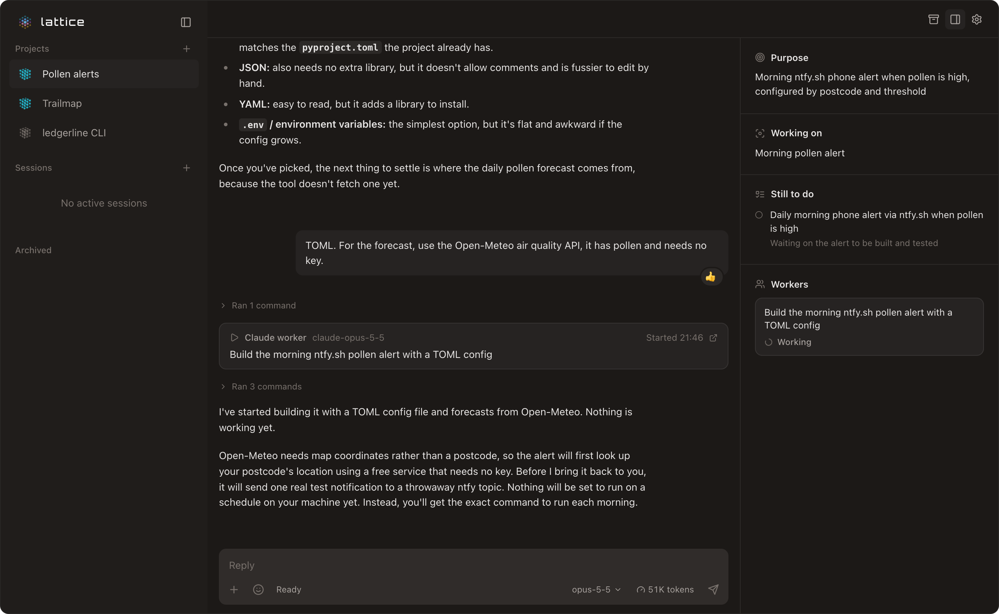
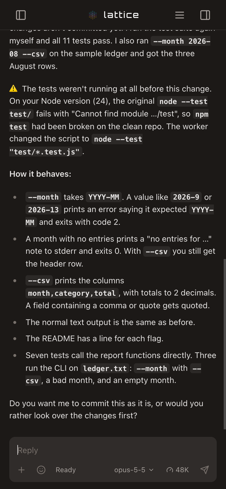

<p align="center">
  <picture>
    <source media="(prefers-color-scheme: dark)" srcset="docs/images/lattice-wordmark-dark.svg">
    
  </picture>
</p>

<p align="center">
  A self-hosted workspace for running Claude Code and Codex agents on your projects.
  <br>
  <a href="#install">Install</a>
  ·
  <a href="#your-first-project">First project</a>
  ·
  <a href="#use-it-from-your-phone-with-tailscale">Phone access</a>
  ·
  <a href="#configuration">Configuration</a>
  ·
  <a href="#development">Development</a>
</p>

<p align="center">
  
</p>

## About

Each project in Lattice has a coordinator: one conversation you talk to about the outcome you want. It agrees the goal with you, starts worker sessions to do the work, keeps a record of what has been decided and what is still open, and reports back in the same thread. You can leave for a day and come back to a project that still knows where it was.

Lattice runs on your own machine and drives the Claude Code and Codex CLIs you already have, signed in with your own accounts. A coordinator can move from Claude to Codex, or back, and keep the project's context. The interface works in a desktop or phone browser, and Tailscale is the simplest way to reach it from your phone.

There is no hosted service. Lattice is pre-release software.

## Requirements

- macOS or Linux
- Node.js 22 or newer (tested on 24 and 26)
- At least one of these agent CLIs, installed on the same machine:
  - [Claude Code](https://code.claude.com/docs/en/setup) (`claude`)
  - [Codex](https://learn.chatgpt.com/docs/codex/cli) (`codex`)

You sign each CLI in with your own account. Lattice never sees a password; it runs the CLIs you already have.

## Install

```bash
npm install -g lattice-app
lattice-app                  # start the server on port 3001
```

Open http://localhost:3001. The server keeps running in that terminal; stop it with Ctrl+C. Run it inside `tmux` or `screen`, or under your own service manager, if it should outlive the terminal. `lattice-app --port 3100` picks another port.

Settings and data live in `~/.lattice-app/`. Set `LATTICE_CONFIG_DIR` to keep them somewhere else, for example to run a second instance on another port. If you already run the older `lattice-orchestrator` package, see [Running next to an existing Lattice](docs/running-next-to-lattice-orchestrator.md).

To work on Lattice itself, build it from a clone instead; see [Development](#development).

## Your first project

1. **Sign in.** The start screen shows whether Claude and Codex are signed in. Click one that isn't to open **Settings → Providers**. For Claude, **Connect** opens Claude Code's own sign-in in a terminal inside the page: tap the link it prints, sign in to Claude, then paste the code back at its prompt. The CLI does the exchange and keeps the login; Lattice only carries what you type, like a web terminal. Signing in from a terminal with `claude` or `codex login` works too, and **Sign in again** renews an expired login the same way. You need one provider; Lattice works with just Claude or just Codex.

   Claude conversations run on that sign-in, that is, your Claude subscription. If you would rather be billed per token by Anthropic, choose **API key** under the Claude card and save a key; it is stored on this machine and never shown again. The same key powers summaries and other background features, and saving it for those does not switch conversations to it unless you choose that.
2. **Set the folder.** Every session starts in one launch folder, your home folder until you change it under **Settings → General → Launch folder**. Point it at the folder your projects live in; a coordinator finds the repositories under it. Agents read and change files there.
3. **Start a project.** Click **New project** in the sidebar, pick whether its coordinator runs on Claude or Codex, describe the outcome you want and send it.

The coordinator is the conversation you talk to. It agrees the goal with you, starts worker sessions (Claude or Codex) to do the work, and reports back in the same thread. It starts workers with a `lattice` command that the server writes to `~/.lattice-app/bin/lattice` each time it starts, so you don't need to install anything on your PATH.

To run a single agent without a coordinator, click **New session** and choose **Claude** or **Codex**.

> [!WARNING]
> Agents run with permission prompts off by default (Claude's `bypassPermissions` mode; Codex runs with full access). They can run any command your user account can, in any folder. Point them only at work you're happy for an agent to do unattended.

## Use it from your phone with Tailscale



The server only listens on this machine (`127.0.0.1`). To reach it from your phone or another computer, use [Tailscale](https://tailscale.com):

1. Install Tailscale on the machine running Lattice and on your phone, and sign both into the same tailnet.
2. On the Lattice machine, run:

   ```bash
   tailscale serve --bg 3001
   ```

   With the Mac App Store version of Tailscale, `tailscale` is not on your PATH; use `/Applications/Tailscale.app/Contents/MacOS/Tailscale` in its place. **Settings → Access** shows the command with the right path for your machine; if something else is already served on your Tailscale address, it gives an `--https=<port>` form that leaves it alone.

   It prints an address like `https://your-machine.your-tailnet.ts.net`. Tailscale forwards it to Lattice, over HTTPS, and only devices on your tailnet can reach it.
3. Open that address on your phone. In Safari or Chrome you can add it to your home screen.

Anyone on your tailnet who can open that address can run agents as you, so check your tailnet's sharing and access rules. `tailscale serve reset` turns it off. Lattice has no login of its own yet: don't bind it to `0.0.0.0` or put it on the public internet.

**Settings → Access** shows the addresses Lattice can see and the command for your port.

## Configuration

`~/.lattice-app/config.json` is created on first run. Useful settings:

| Setting | What it does |
|---------|--------------|
| `server.port` | Port to listen on (default `3001`; `--port` overrides it) |
| `server.defaultWorkingDirectory` | Folder new sessions start in until you pick one |
| `server.defaultModel` | Claude model for new Claude sessions |
| `server.defaultPermissionMode` | Claude permission mode: `default` (ask), `acceptEdits`, `bypassPermissions`, `plan` |
| `coordinator.provider` | `claude` or `codex`: which one the Coordinator choice starts on |
| `feedback.enabled` | Whether you can send feedback about Lattice (default on; the switch in Settings → General) |
| `feedback.collectorUrl` | Where feedback goes; a fork running its own feedback collector points this at it |

Asking for permission (`default` mode) needs Lattice to register hooks in `~/.claude/settings.json`. It only does that for the instance you allow; see [docs/host-integration-marker.md](docs/host-integration-marker.md).

## Feedback

Feedback is on by default and nothing is sent until you press Send. The first send runs one check that you are a person; after that each message sends with one click. Switch it off in Settings → General. The Feedback button on a session, the phone menu and Settings → General open a form that shows exactly what will be sent. Agents can propose feedback with `lattice feedback "…" --session <conv-id>`; that only saves a draft, which appears as a card in your chat (a worker's in its project's chat) for you to send, edit or reject.

Whoever runs the collector reads what arrives in their own Lattice: put `{"collectorUrl": "https://…", "readToken": "…"}` in `~/.lattice-app/feedback-inbox.json` with mode 600, and a Feedback inbox appears in the sidebar. Without that file there is no inbox.

## Personal settings

Agents refer to you as "the user" unless you set a name. Standing guidance you want every coordinator or worker to follow goes here too:

```json
{
  "user": {
    "name": "Sam",
    "coordinatorGuidance": "Ask before changing a public API.",
    "workerGuidance": "Run the project's tests before reporting.",
    "projects": ["my-app", "my-library"]
  }
}
```

`projects` gives session summaries a list of project names to match against.

## Repository layout

| Path | What it is |
|------|------------|
| `src/` | The Lattice server, CLI and web app |
| `packages/harness` | `@liggi/agent-ui-harness`: runs an agent CLI process and streams its events to a browser |
| `packages/toolkit` | `@liggi/agent-ui-toolkit`: React components for rendering agent tool calls |

## Development

Building from a clone needs pnpm 10 as well as Node. Install pnpm with `npm install -g pnpm@10` or `brew install pnpm`. On Node 22–24 `corepack enable` also works; Node 25 and later no longer include corepack.

```bash
git clone https://github.com/Liggi/lattice-app.git lattice
cd lattice
pnpm install     # also builds the bundled harness and toolkit packages
pnpm build
pnpm start       # same as: node dist/cli.js serve
```

A clone uses the same `~/.lattice-app/` data folder as the npm package, so stop one before starting the other, or give the clone its own folder with `LATTICE_CONFIG_DIR`. Don't `npm link` the clone next to an installed `lattice-app`: both provide the `lattice-app` command. `pnpm pack:release` builds the npm tarball from a built clone.

```bash
pnpm typecheck
pnpm lint
pnpm test:unit        # app unit tests
pnpm test:packages    # harness and toolkit tests
pnpm test             # Playwright behavioural tests (needs `npx playwright install`)
pnpm dev              # server with reload on change, from source
```

`pnpm dev` runs from `src/` under `tsx` and reloads on changes. On Linux, `pnpm service:setup` installs optional systemd user services; the other `service:*` scripts manage them.

## Licence

Apache License 2.0; see [LICENSE](LICENSE). The harness and toolkit packages are MIT-licensed; see their own LICENSE files. Lattice began as a fork of [CUI](https://github.com/wbopan/cui) by Wenbo Pan; see [NOTICE](NOTICE).
